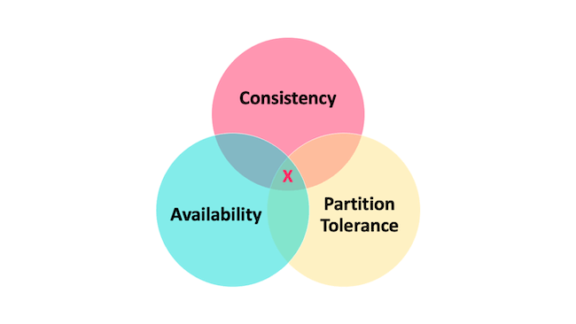
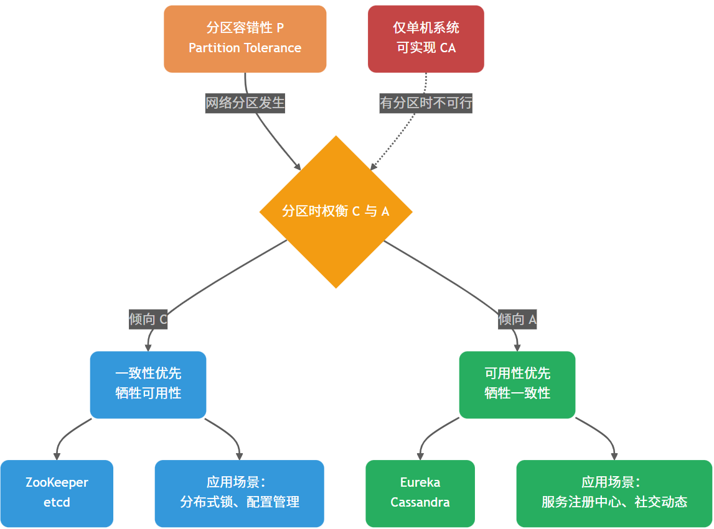
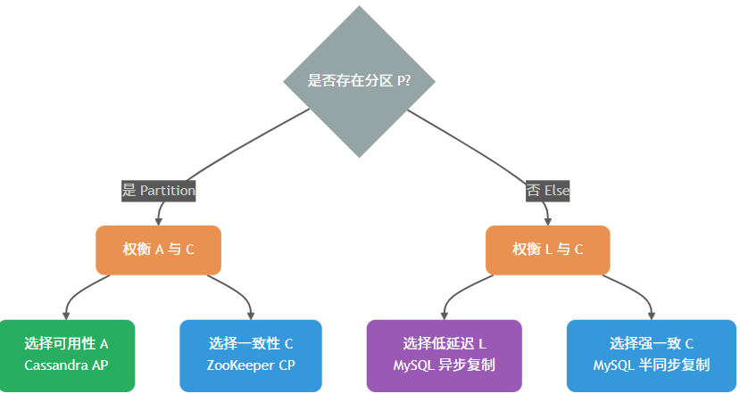
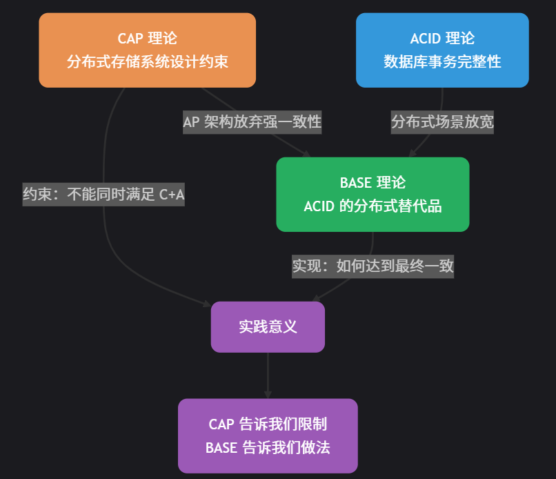

# CAP理论 BASE理论
参考：
[CAP & BASE理论详解](https://javaguide.cn/distributed-system/protocol/cap-and-base-theorem.html#%E7%AE%80%E4%BB%8B)
## CAP理论
CAP理论是由加州伯克利大学的一名教授在2000年提出的。CAP 定理讨论 Consistency（一致性）、Availability（可用性）和 Partition Tolerance（分区容错）。

- 一致性：是指Atomic Consistency，通常等于Linearizability线性一致性，即所有操作按实时顺序线性化，一旦完成写操作，后所有读操作都必须返回该写入值。（数据一致性）
- 可用性：非故障节点必须对每个请求返回响应。
- 分区容错性： P 本质上是在假设异步网络（可能延迟/丢包/分区），不是一个你「选择要不要」的功能。真正的权衡是：当分区发生时必须在**线性一致（CAP 的 Consistency=Linearizability）与CAP-Availability（任何非故障节点都要对请求给非错误响应）**之间做选择。

CAP理论的逻辑是：CAP 理论中分区容错性 P 不是一定要满足的，但当选择满足 P 时，在此基础上只能满足可用性 A 或者一致性 C。
能够保证 CA 的只有单机系统——因为只有一个节点，数据写入成功后所有请求都能看到相同数据；只要这个节点活着，系统就可用。分布式系统离不开网络通信，而网络故障是常态，比如心跳检测可能因网络抖动丢包，导致误判节点故障，比如数据同步过程中可能因包丢失导致不一致，系统为达成一致会不断重试，造成请求阻塞。

基于CAP理解的防护措施：
1. 理解底层组件的CAP属性
2. 多层防护，不依赖单一组件，结合本地缓存、熔断、降级
3. 超时与重试，合理设置超时时间，避免无限等待
4. 隔离机制，不同业务使用不同底层组件实例，避免故障扩散

## BASE理论
BASE理论是有eBay的架构师在2008年发表提出的。BASE 是 Basically Available（基本可用）、Soft-state（软状态） 和 Eventually Consistent（最终一致性） 三个短语的缩写。
BASE 理论承认并允许这种中间态（请求开始-请求执行中间的间隙）的存在。
    - Bacially Available：在系统出现不可预知的故障时，允许损失部分可用性。不等价系统不可用。（比如响应时间变长，非核心功能无法使用）
    - Soft-state（软状态）：允许系统存在中间态，且该中间态不影响系统整体可用性（与ACID理论的核心区别）
    - Eventually consistent（最终一致性）：中间态最终会演变成终态（要么成功，要么回滚）。**系统会保证在一定时间内达到数据一致的状态，而不需要实时保证系统数据的强一致性**（CAP的一致性是后者）。

## 问题
1. 实现最终一致性的具体方式是什么？
    - 读时修复（Read Repair）：在读取数据时，检测数据的不一致，进行修复。适合读多写少，保证读取数据的准确性。
    - 写时修复（Hinted Handoff）：在写入数据时，如果目标节点不可用，将数据缓存下来，待节点恢复后重传。写时修复优化了写入延迟，但增加了读取时的不一致风险（数据可能还在缓存队列中未落盘到目标节点）。适合写多读少，优化写入性能，但牺牲一致性窗口。
    - 异步修复（Anti-Entropy/反熵）：通过后台比对副本数据差异并修复。工程实现中关键挑战是高效检测数据差异——暴力逐条比对（O(n)）在大规模数据集下不可行，生产系统采用**默克尔树（Merkle Tree）**实现低开销差异定位。后台兜底保障，适合数据规模大但对最终一致性要求高的场景。
2. 为什么很多人把 BASE 当作 CAP 的补充？
    BASE 与 CAP 的 AP 架构存在内在联系：选择 AP 架构意味着放弃强一致性（C）放弃强一致性后，系统如何达到收敛？答案是最终一致性因此，BASE 理论（特别是最终一致性）是 AP 架构在工程实践中必须采用的指导原则。
    
3. 选择 CP 还是 AP ？
    监控指标：
    - 分区检测时间：多久发现网络分区
    - 收敛时间（Convergence Time）：副本从不一致到一致的时间
    - 读写延迟 P99：CAP 权衡的直接体现
    - 不一致窗口：业务可接受的数据延迟

    | 场景特征 | 倾向选择 | 典型系统说明 |
    | :--- | :--- | :--- |
    | **强一致性要求（金融转账）** | 倾向线性一致写 | ZooKeeper（写入需 Quorum 确认）、etcd、Consul（CP 模式） |
    | **高可用优先（服务发现）** | 倾向可用性 | Eureka（允许读到旧实例）、Consul（可切换模式） |
    | **可调一致性（根据业务动态选择）** | 可配置 | Nacos（支持 CP/AP 切换）、Cassandra（可调节读写一致性级别） |
    | **写多读少** | 倾向异步写优化 | Cassandra（可配置 QUORUM 写）、HBase |
    | **读多写少** | 倾向低延迟读 | DynamoDB（可调节最终一致性级别） |
4. CAP 相关误区
    * ❌ 「选择了 AP 就永远放弃一致性」 $\rightarrow$ ✅ AP 系统可通过 Read Repair、Anti-Entropy（Merkle Tree）达到最终一致
    * ❌ 「ZooKeeper 是强一致的」 $\rightarrow$ ✅ ZooKeeper 提供线性化写入 + 顺序一致性读取（非最终一致性），读取存在滞后但保证全局顺序
    * ❌ 「顺序一致性 = 最终一致性」 $\rightarrow$ ✅ 顺序一致性保证全局更新顺序，最终一致性不保证顺序；ZooKeeper 普通读取是前者而非后者
    * ❌ 「银行系统必须 CP」 $\rightarrow$ ✅ 实际银行采用 BASE + 补偿事务（Saga），核心账务强一致，查询服务可最终一致
    * ❌ 「业务系统不需要考虑 CAP」 $\rightarrow$ ✅ 业务系统虽不直接实践 CAP，但 RPC 路由、限流熔断、分布式锁等均受底层组件 CAP 属性影响，忽视会导致级联雪崩
    * ❌ 「分库分表不需要考虑 CAP」 $\rightarrow$ ✅ 分片式存储通常仍然需要为每个 shard 做副本复制，因此仍需面对 CAP 的权衡
    * ❌ 「CAP 的 A 等于低延迟/高 SLA」 $\rightarrow$ ✅ CAP 的可用性定义不包含延迟要求，只要求非故障节点必须返回响应（可以很慢）
5. BASE 相关误区
    * ❌ 「BASE 是 CAP 的补充/延伸」 $\rightarrow$ ✅ BASE 首先是 ACID 的替代品；同时 BASE 是 AP 架构的工程实践指南（AP 选择了放弃强一致性，BASE 告诉你如何达到最终一致）
    * ❌ 「BASE 的一致性 = CAP 的一致性」 $\rightarrow$ ✅ BASE 的一致性是状态一致性（= ACID 一致性），CAP 的一致性是数据一致性
    * ❌ 「BASE 只适用于主从集群」 $\rightarrow$ ✅ BASE 适用于所有分布式系统；其「基本可用」概念在分片式集群中表现更明显（部分节点故障只影响部分用户）
    * ❌ 「最终一致性是弱一致性」 $\rightarrow$ ✅ 最终一致性是弱一致性的升级版，保证系统最终会达到一致状态，而弱一致性不提供此保证