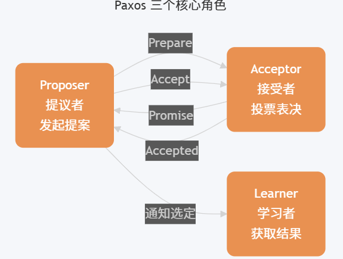

# Paxos 一种分布式系统 共识 算法
参考：[Paxos 算法详解](https://javaguide.cn/distributed-system/protocol/paxos-algorithm.html#%E8%83%8C%E6%99%AF)

Paxos 算法是 Lamport 在 1990 年提出的分布式共识算法，是强一致性共识的理论基础
- Paxos 针对的是无恶意节点，衍生出Raft，ZAB，Fast Paxos
- 相反的解决拜占庭问题的是有恶意节点的，有工作量证明PoW、权益证明PoS

## Basic Paxos 算法
**Basic Paxos 算法仅能就单个值达成共识**
Basic Paxos 中存在 3 个重要的角色：
- 提议者（Proposer）：也可以叫做协调者（coordinator），负责接受客户端请求并发起提案。提案信息通常包括提案编号（proposal ID）和提议的值（value）。
- 接受者（Acceptor）：也可以叫做投票员（voter），负责对提案进行投票，同时需要记住自己的投票历史。
- 学习者（Learner）：负责学习（learn）已被选定的值。在复制状态机（RSM）实现中，该值通常对应一条待执行的命令，由状态机按序 apply 后再由对外服务层返回结果。
（为了减少实现该算法所需的节点数，一个节点可以身兼多个角色。并且，一个提案被选定需要被半数以上的 Acceptor 接受。）

Basic Paxos 通过两个阶段达成共识：Prepare/Promise阶段（争夺锁和获取历史）和 Accept/Accepted阶段（提交决议）。

但存在活锁问题，若多个 Proposer 同时发起提案，且提案编号交错递增可能导致没有提案能获得超过半数的 Accept系统陷入无限竞争，无法达成共识。
活锁示例：假设有两个 Proposer P1 和 P2 同时发起提案：P1 发送 Prepare(1)，P2 发送 Prepare(2)Acceptor 们承诺给编号较大的 P2P1 发现编号被超越，发送 Prepare(3)P2 发现编号被超越，发送 Prepare(4)... 循环往复，永远无法进入 Phase 2 accept阶段。
=> 解决方案：通过 Multi-Paxos 引入稳定的 Leader 机制。生产级实现通常引入随机退避（等待一个随机事件，选择更大的提案编号，重试prepare）。


## Multi-Paxos 思想
**Multi-Paxos 通过多个 Basic Paxos 实例就一系列值达成共识**
Multi-Paxos 的核心优化思想是复用 Leader：通过 Basic Paxos 选出一个稳定的 Proposer 作为 Leader，后续提案直接由该 Leader 发起，避免多 Proposer 竞争导致的活锁，跳过 Phase 1 的 Prepare/Promise 阶段，减少一轮 RPC。

可能存在日志空洞问题：当新 Leader 上线时，可能遇到一种棘手场景——前任 Leader 已经在某个日志位置上达成了共识，但新 Leader 不知道这个值。如果新 Leader 试图在该位置提交新值，就会覆盖已经选定的值，破坏一致性。
解决方案是NOP（No-Operation）日志：
- 场景检测：新 Leader 收集 Acceptor 返回的已接受值。
- 必须复用：如果发现某位置已有被选定的值，新 Leader 必须复用该值，不能提出新值。(还是prepare阶段)
NOP 占位：对于空洞位置（无任何已接受值），新 Leader 可以提交特殊值——NOP（空操作）。
- 状态机跳过：NOP 日志虽然占用日志位置，但状态机回放时会跳过，不执行任何业务逻辑
- 示例：
```
前任 Leader 崩溃前：
Index 1: Value=A (chosen)
Index 2: Value=B (chosen)
Index 3: <空洞> (未完成)

新 Leader 上线后：
Index 1: 复用 Value=A
Index 2: 复用 Value=B
Index 3: 提交 NOP (填补空洞，不执行业务逻辑)
Index 4: 提交 Value=C (正常业务日志)
```
## 应用
基于 Paxos 算法或其变体的系统包括：
- Google Chubby：基于 Paxos 实现的分布式锁服务
- Apache ZooKeeper 3.8+：基于 ZAB 协议（类 Multi-Paxos，写入通过 Leader 广播，支持 FIFO 顺序）
- etcd 3.5+：基于 Raft 算法（强一致性共识，支持动态成员变更、轻量级事务 Txn）
- HashiCorp Consul：基于 Raft 算法（服务发现与配置管理）


## 问题
1. Raft 与 Paxos 的关系？
    从学术角度，Raft 并非 Paxos 的严格变体——两者在底层设计哲学（如日志空洞、Leader 权限）上存在本质差异。但从工程实践角度，Raft 的设计灵感源于 Multi-Paxos，可理解为"受 Multi-Paxos 启发的重新设计"。

    | 对比维度 | Multi-Paxos | Raft | 核心工程影响 |
    | :--- | :--- | :--- | :--- |
    | 日志流向与约束 | 允许乱序提交，允许出现日志空洞。 | 强制按序追加（Append-Only），绝对不允许日志空洞。 | Raft 实现简单，状态机回放极其顺滑；Paxos 并发上限更高，但实现难度呈指数级增加。 |
    | **Leader** 选举与权限 | Leader 仅是一个性能优化手段（省略 Phase 1），非必须角色。 | **强 Leader** 模型。一切数据以 Leader 为准，日志只从 Leader 流向 Follower。 | Raft 通过限制只能选取“日志最完整”的节点当选 Leader，简化了数据恢复逻辑。 |
    | 活锁防御 | 需额外引入随机退避或外部选主算法。 | 协议内置基于随机超时（Randomized Timeout）的选主防御机制。 | Raft 的开箱即用性（Out-of-the-box）远高于 Paxos。 |
    | 工业级落地代表 | Apache ZooKeeper (基于 ZAB, 类 Multi-Paxos), Google Spanner | etcd, HashiCorp Consul, TiKV | 现代微服务基础设施倾向于选择 Raft。 |