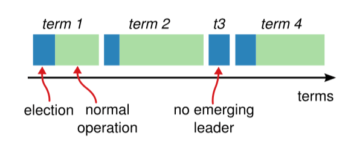
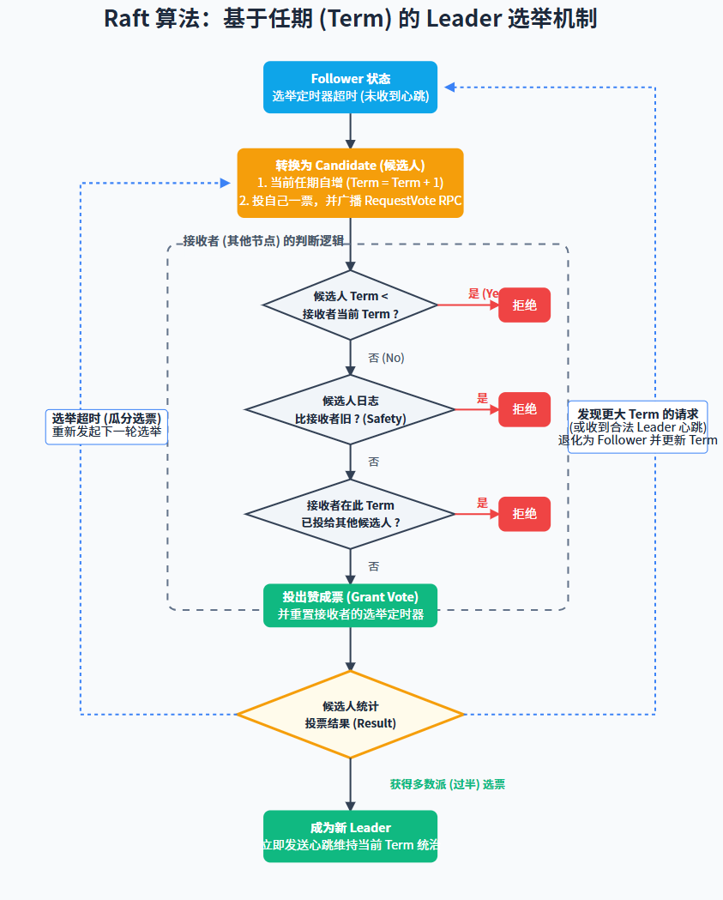
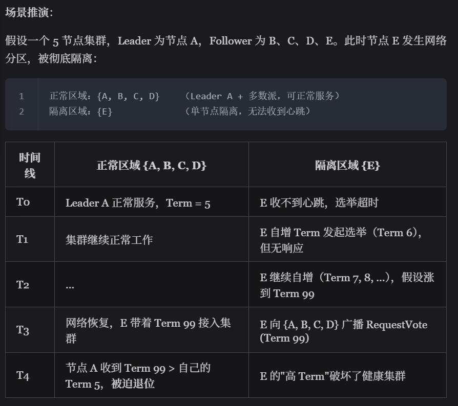

# Raft 算法: 功能分离、易于理解的共识算法
参考：[Raft 算法详解](https://javaguide.cn/distributed-system/protocol/raft-algorithm.html#_2-1-%E8%8A%82%E7%82%B9%E7%B1%BB%E5%9E%8B)

Raft将共识问题拆解为Leader选举（随机化选举超时）、日志复制（Leader 通过 AppendEntries RPC 广播日志）、安全性（选举限制和日志匹配）。

## 技术点
1. 三个角色
    在任意时间，每个服务器一定会处于三个状态中的一个：
    - Leader（领导者）：大当家。全权负责接待客户端、写账本、并把账本同步给小弟。为了防止别人篡位，他必须不断地向全员发送心跳，宣告“我还活着”。
    - Follower（跟随者）：安分守己的小弟。平时绝对不主动发起请求，只被动接收老大的心跳和账本同步。
    - Candidate（候选人）：临时状态。如果小弟迟迟等不到老大的心跳，就会觉得自己行了，变身候选人开始拉票。
2. 任期机制
    
    Raft 算法将时间划分为任意长度的任期（term），任期用连续的数字表示，看作当前 term 号。每一个任期的开始都是一次选举，在选举开始时，一个或多个 Candidate 会尝试成为 Leader。如果一个 Candidate 赢得了选举，它就会在该任期内担任 Leader。如果没有选出 Leader（例如出现分票 split vote），该任期可能没有 Leader；随后在新的选举超时后会进入下一个任期并重新发起选举。只要多数节点可用且网络最终可达，系统通常能够在若干轮选举后选出 Leader。
    每个节点都会存储当前的 term 号，当服务器之间进行通信时会交换当前的 term 号；如果有服务器发现自己的 term 号比其他人小，那么他会更新到较大的 term 值。如果一个 Candidate 或者 Leader 发现自己的 term 过期了，他会立即退回成 Follower。如果一台服务器收到的请求的 term 号是过期的，那么它会拒绝此次请求。
    
    Raft 使用了随机的选举超时时间来避免多个Candidate竞争无限重复的情况。每一个 Candidate 在发起选举后，都会随机化一个新的选举超时时间，这种机制使得各个服务器能够分散开来，在大多数情况下只有一个服务器会率先超时；它会在其他服务器超时之前赢得选举。
3. 日志结构
    只有 Leader 有资格往账本里追加记录（Entry）。一条日志包含三个核心要素：<当前任期term, 索引号index, 具体操作指令cmd>。
    有两个非常关键的进度指针：
    - commitIndex：大家公认已经安全落地的日志进度（已经被复制到过半数节点）。
    - lastApplied：这台机器本地真正执行完的日志进度。

    过程：
    1. 一旦选出了 Leader，它就开始接受客户端的请求。每一个客户端的请求都包含一条需要被复制状态机（Replicated State Machine）执行的命令。
    2. Leader 收到客户端请求后，会生成一个 entry，包含<index,term,cmd>，再将这个 entry 添加到自己的日志末尾后，向所有的节点广播该 entry，要求其他服务器复制这条 entry。
    3. 如果 Follower 接受该 entry，则会将 entry 添加到自己的日志后面，同时返回给 Leader 同意。
    4. 如果 Leader 收到了多数 Follower 对该日志复制成功的响应，Leader 会推进自己的 commitIndex，并在随后将这些已提交（committed）的日志按顺序应用（apply）到状态机后再向客户端返回结果。
    5. Follower 不会自行决定提交点；它们从 Leader 的 AppendEntries RPC 中携带的 leaderCommit 得知当前可提交的最大索引，并将本地 commitIndex 更新为 min(leaderCommit, lastLogIndex)，再按序 apply 到状态机。

    Raft 通过 日志匹配属性（Log Matching Property） 保证日志绝对不会分叉。该属性包含两个核心保证：
    - 保证一：如果两个日志在相同 index 位置的 entry 具有相同的 term，那么它们存储的 cmd 一定相同.
    - 保证二：如果两个日志在相同 index 位置的 entry 具有相同的 term，那么该位置之前的所有 entry 也完全相同（归纳法证明）
    （判断日志新旧的方式：如果两个日志的 term 不同，term 大的更新；如果 term 相同，更长的 index 更新）

    所以当日志不一致时怎么修复？
    新老交替之际往往会在集群中遗留大量未对齐的脏数据。这时，新 Leader 发起 AppendEntries 同步请求就会触发“一致性检查报错”。Raft 解决数据冲突的逻辑非常霸道：一切以现任 Leader 的账本为最高准则，Follower 本地任何不一致的记录都必须被无情抹除并强行覆盖。
    具体来说，Leader 会往前倒推寻找双方最后一次完美吻合的历史节点。找到这个“分叉点”后，Follower 会把分叉点之后的烂摊子全部咔嚓掉，老老实实地拷贝 Leader 提供的最新日志。
    在代码层面，Leader 会在内存里给每个 Follower 单独记一本账，核心指针叫 nextIndex（预估要发给该小弟的下一条日志位置）。Leader 刚接盘时，会盲目自信地把所有小弟的 nextIndex 都预设为自己最新日志的索引加一。如果小弟的数据其实比较落后或者有冲突，第一发 AppendEntries 必然惨遭拒绝。接下来就是找分叉点的两种流派：
    - 传统的朴素做法（逐条试探）：撞了南墙就退一步。Leader 会把 nextIndex 减一，再发一次 RPC 试探。如果还不行，就继续减一，犹如乌龟漫步般逐条往前回退，直到彻底对上暗号。
    - 工业级提速优化（Fast Backup 快速回退）：在真实的生产环境中，逐条回退绝对是性能灾难。因此，工业界引入了快速回退机制。小弟在拒绝同步时返回错乱的日志属于哪段term以及term的头尾边界。Leader 拿到这份情报，直接一次性跨越整段错误任期，极大地削减了冗余的网络重试次数，nextIndex 终将精准锚定双方的共识起点。此时，AppendEntries 终于收获成功回执，Follower 上的冲突数据被彻底清空，缺失的正统日志被严丝合缝地填补。一旦跨过这个坎，双方的账本就能在整个任期内保持高度一致。
4. 安全性
    1. 选举限制
    Leader 需要保证自己存储全部已经提交的日志条目。这样才可以使日志条目只有一个流向：从 Leader 流向 Follower，Leader 永远不会覆盖已经存在的日志条目。
    每个 Candidate 发送 RequestVote RPC 时，都会带上最后一个 entry 的信息。所有节点收到投票信息时，会对该 entry 进行比较，如果发现自己的更新，则拒绝投票给该 Candidate。
    2. 提交规则
    Leader 推进 commitIndex 时，需要满足"当前任期产生的某条日志已复制到多数派"这一条件。对于旧任期遗留的日志，即使它们已经复制到多数派，Leader 也不应仅凭此直接提交；通常通过提交当前任期的一条新日志（常见为 no-op）来间接提交历史日志。这一限制用于避免 Leader 频繁切换时出现已提交日志被覆盖的安全性问题。
    3. 节点崩溃与网络分区
    如果 Follower 和 Candidate 崩溃，处理方式会简单很多。之后发送给它的 RequestVote RPC 和 AppendEntries RPC 会失败。由于 Raft 的所有请求都是幂等的，所以失败的话会无限的重试。如果崩溃恢复后，就可以收到新的请求，然后选择追加或者拒绝 entry。
    如果 Leader 崩溃，节点在 electionTimeout 内收不到心跳会触发新一轮选主；在选主完成前，系统通常无法对外提供线性一致的写入（以及线性一致读），表现为一段不可用窗口。
    4. 时间与可用性
    Raft 的要求之一就是安全性不依赖于时间：系统不能仅仅因为一些事件发生的比预想的快一些或者慢一些就产生错误。最好能满足以下的时间条件：`broadcastTime << electionTimeout << MTBF`
    - broadcastTime：向其他节点并发发送消息的平均响应时间；
    - electionTimeout：选举超时时间；
    - MTBF(mean time between failures)：单台机器的平均健康时间；
    broadcastTime应该比electionTimeout小一个数量级，为的是使Leader能够持续发送心跳信息（heartbeat）来阻止Follower开始选举；
    electionTimeout也要比MTBF小几个数量级，为的是使得系统稳定运行。当Leader崩溃时，大约会在整个electionTimeout的时间内不可用；希望这种情况仅占全部时间的很小一部分。
    由于broadcastTime和MTBF是由系统决定的属性，因此需要决定electionTimeout的时间。一般来说，broadcastTime 一般为 0.5 ～ 20ms，electionTimeout 可以设置为 10 ～ 500ms（工程上常见如 150–300ms），MTBF 一般为一两个月。

## 场景
1. 单节点隔离与 Term 暴增问题
    在标准 Raft 算法中，单节点网络隔离可能导致 Term 暴增（Term Inflation） 问题，造成"劣币驱逐良币"一个被隔离的少数派节点在恢复后破坏健康集群的稳定性。会造成整个集群需要重新选举，造成不必要的写入中断。
    

    解决方法：扩展Raft的Pre-Vote方案，要求节点在真正发起选举前，先进行一次"预投票"。只有确认自己与 Leader 失去连接后，节点才开始真正增加 Term。
    - 预投票阶段：Candidate 向其他节点发送 PreVoteRequest，携带自己的日志信息。
    - 预投票条件： 候选人的日志至少与接收者一样新（选举限制）；接收者确认自己与 Leader 的连接已断开（超过 electionTimeout 未收到心跳）
    - 正式选举：只有收到多数节点的 PreVote 响应后，才真正增加 term 并发起 RequestVote
在上述单节点隔离场景中，E 在隔离期间发起 Pre-Vote 时，其他节点仍能收到 Leader A 的心跳因此其他节点会拒绝 E 的 PreVote 请求（因为与 Leader 连接正常）E 无法获得多数 PreVote 响应，不会真正增加 Term网络恢复后，E 的 Term 仍然较低，不会干扰健康的 Leader A。

## 问题
1. ZooKeeper的follower怎么知道leader崩溃？怎么知道发生网络分区了？
    在 ZooKeeper（ZAB 协议）中，Follower 感知 Leader 崩溃以及发现网络分区，核心依赖的是基于 TCP 长连接的“心跳机制（Heartbeat）”与“超时检测”。
    - 感知 Leader 崩溃： Leader 会定期向集群发送心跳包。Follower 若在设定的超时时间内未收到心跳，即判定 Leader 已宕机，随即转入 LOOKING 状态发起新一轮选举。
    - 感知网络分区： 当发生分区时，原 Leader 若发现自己无法收到过半数节点的心跳应答，便会意识到自己已陷入少数派网络孤岛。此时它会主动放弃 Leader 身份进行降级，从而避免“脑裂”。
2. Raft怎么处理old leader遗留的日志？
    当一个新 Leader 上台时，它的本地可能包含前任 Leader 遗留下来的未提交日志。即使新 Leader 努力把这些“旧日志”复制到了集群的多数派（过半节点），它也不能直接将旧日志标记为 Commit（已提交）。
    Raft 算法定下了一条铁律：Leader 只有在将一条带有自己“当前任期号”的日志成功复制到多数派之后，才能推进提交进度。一旦当前任期的日志在多数派上站稳了脚跟，Raft 的选举机制就能确保未来任何新 Leader 都必定包含这些日志，再也不会发生覆盖。
    那前任留下的数据怎么办？Raft 的常见工程实现是：新 Leader 刚当选时，立刻主动向集群追加并广播一条没有任何实际业务操作的空日志（no-op）。这条空日志带有 Leader 的最新任期号。根据 Raft 的“日志连续性匹配”原则，只要这条空日志被多数派确认并提交，排在它前面的所有历史旧日志，就会跟着“搭便车”，被顺理成章地一并安全提交。
3. 