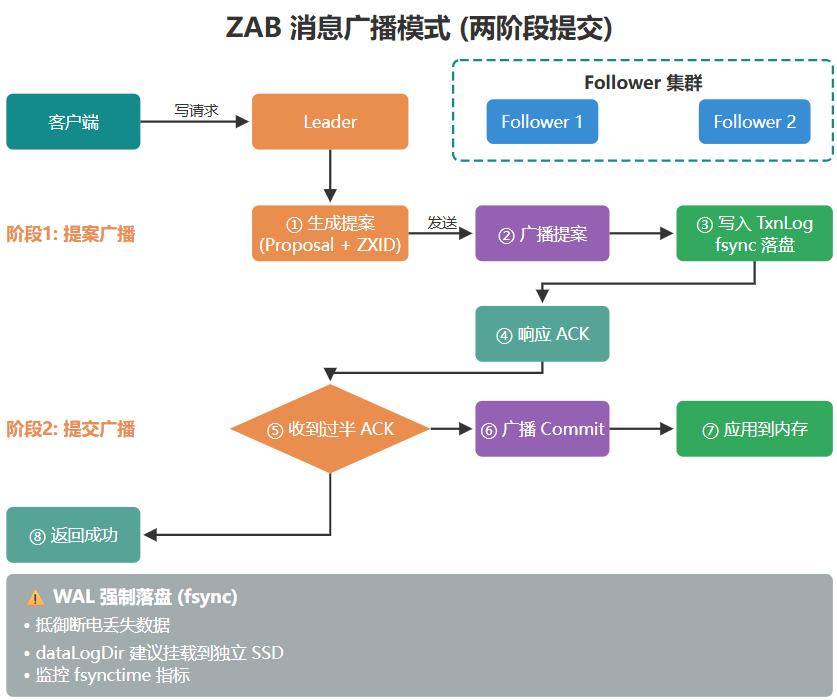

# ZAB 协议 专为 ZooKeeper 设计的、支持崩溃可恢复的原子消息广播算法

参考：[ZAB 协议详解](https://javaguide.cn/distributed-system/protocol/zab.html)
ZooKeeper 集群中的三个主要角色：
- Leader（领导者）： 集群中唯一的写请求处理者。它负责发起投票和协调事务，所有的写操作都必须经过 Leader。
- Follower（跟随者）： 可以直接处理客户端的读请求。收到写请求时，会将其转发给 Leader。在 Leader 选举过程中，Follower 拥有选举权和被选举权。
- Observer（观察者）： 功能与 Follower 类似，但没有选举权和被选举权。它的存在是为了在不影响集群共识性能（即不增加需要等待的投票数）的前提下，横向扩展集群的读性能。
对应的，集群中的节点通常处于以下四种状态之一：
- LOOKING：寻找 Leader 状态（正在进行选举）。
- LEADING：当前节点是 Leader，正在领导集群。
- FOLLOWING：当前节点是 Follower，服从 Leader 领导。
- OBSERVING：当前节点是 Observer。

## 技术要点

ZAB的核心是zxid
ZXID（ZooKeeper Transaction ID） 是一个全局单调递增的事务 ID, 64 位的长整型（long）：
- 高 32 位（Epoch / 纪元）： 代表当前 Leader 的任期年代。当选出一个新的 Leader 时，Epoch 就会在前一个的基础上加 1。这相当于朝代更替。
- 低 32 位（Counter / 事务 ID）： 一个简单的递增计数器，保证顺序性。针对客户端的每一个写请求，计数器都会加 1。新 Leader 上位时，这个低 32 位会被清零重置。

ZAB的两种模式：
1. 消息广播波模式（正常工作状态） - 两阶段提交（2PC）
前提：拥有健康的Leader并且过半的节点完成了状态同步
过程：

2. 崩溃恢复（异常或启动状态）
前提：系统刚启动，或Leader崩溃且，或（网络分区）过半Follower失联，集群暂停对外服务进入LOOKING状态
过程：Leader选举 + 数据恢复
- Leader选举：各节点自荐投第一票（Epoch，zxid，myid），myid是节点唯一id→ Epoch大者胜 > zxid大者胜即数据新 > myid大者胜 -> 某一节点获过半选票 ↓
- 数据同步：新leader产生（Epoch+1，Counter清零）→ Follower连接并同步数据（Leader根据Follower发送的lastzxid采取某一策略：DIFF增量同步，TRUNC丢弃未提交日志，SNAP全量快照同步）→ 过半机器完成同步→ 进入消息广播模式（恢复正常）
（注意：为了保证数据一致性，在数据同步时需要保证①已被old leader committed的数据最终会被所有节点committed，②而只在old leader上proposal但为committed的要丢弃。

## 问题
1. 如果old leader 苏醒会发生什么？
    若原 Leader 因 JVM 触发长达数十秒的 Full GC 而发生"假死"，当其苏醒并试图向集群下发旧 Epoch 的提案时，由于过半节点已记录了更高的新 Epoch 且已向新 Leader 提交 quorum，这些幽灵提案将被节点无情拒绝并抛弃。ZAB 正是通过 Epoch 机制 + 多数派 quorum 的组合，从根本上免疫了网络环境下的脑裂现象——单靠 Epoch 拒绝还不够，必须有过半节点已经连上新 Leader，旧 Leader 才真正失去写入能力。
1. ZAB与Raft对比
    相同点：它们都有唯一的主节点，都使用 Epoch/Term 来标识任期，并且都采用了只要半数以上节点确认即可提交的策略。
    不同点：Raft开箱即用，从设计之初就强调易懂性和可实现性，它将领导者选举、日志复制和安全性明确分离，这使得开发者更容易正确实施和调试，而 ZAB 作为 ZooKeeper 的专有协议，更侧重于原子广播的特定需求，导致其通用性较差。
1. ZAB是CP还是AP？
    ZAB在分布式系统的分区容错性（P）和一致性（C）之间做出了选择（满足 CP 属性）。当出现网络分区时，ZAB 宁愿牺牲短暂的可用性（A）进行选举，也要保证数据的一致性。需要特别强调的是，ZAB 协议默认不保证严格的强一致性（线性一致性），而是提供顺序一致性（Sequential Consistency）。
    由于 Follower 可以直接处理客户端的读请求且不强求数据绝对同步，客户端完全可能读取到落后于 Leader 的陈旧数据（Stale Read）。在生产环境中，若业务涉及如分布式锁等对数据新鲜度要求极高的场景，必须在执行 read() 操作前显式调用 sync() 原语，强制要求连接的 Follower 追平 Leader 的事务状态机。
