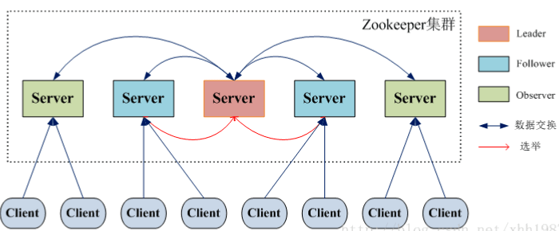
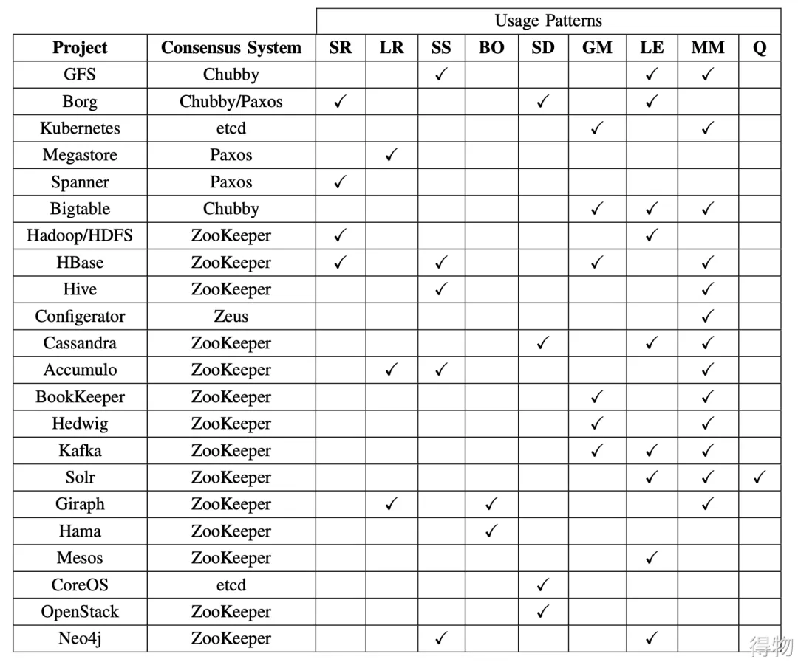

# ZooKeeper 一个通用的无单点问题的分布式协调框架
参考：
[https://javaguide.cn/distributed-system/distributed-process-coordination/zookeeper/zookeeper-intro.html](https://javaguide.cn/distributed-system/distributed-process-coordination/zookeeper/zookeeper-intro.html)
```
         |——————————————————|     数据发布/订阅、负载均衡、
原语集-->|     ZooKeeper    | ---->集群管理、Master选举、
         | 数据存储+事件监听 | ---->命名服务、分布式协调/通知、
         |——————————————————|     分布式锁和队列等
```
前提条件：
1. “读”多于“写”是协调服务的典型场景
2. 存在重复单调的配置逻辑

ZooKeeper 底层其实只提供了两个功能：
1. 管理（存储、读取）用户程序提交的数据；
2. 为用户程序提供数据节点监听服务。

特点：
1. 数据一致性： 所有客户端看到的数据变更顺序是一致的，按照操作被提交的全局 FIFO 顺序进行更新。但这并不保证变更会立即传播到所有节点。
1. 顺序一致性：所有的写请求都是有序的；集群中只有leader机器可以写，所有机器都可以读，所有写请求都会分配一个zk集群全局的唯一递增编号：zxid，用来保证各种客户端发起的写请求都是有顺序的。
2. 原子性：所有事务请求的处理结果在整个集群中所有机器上的应用情况是一致的。
3. 可靠性： 一旦一次更改请求被应用，更改的结果就会被持久化，直到被下一次更改覆盖。
4. 集群部署：3~5 台（最好奇数台）机器就可以组成一个集群，每台机器都在**内存**保存了 ZooKeeper 的全部数据，机器之间互相通信同步数据，客户端连接任何一台机器都可以。
5. 高可用：如果某台机器宕机，会保证数据不丢失。集群中挂掉不超过一半的机器，都能保证集群可用。

技术点：
1. 模型
    ZooKeeper采用层次化的多叉树形结构，每个节点是ZNode，根节点的值是“/”，每个ZNode有唯一路径标识。ZooKeeper 主要是用来协调服务的，而不是用来存储业务数据的，所以不要放比较大的数据在ZNode（数据大小上限是 1M）上 。
    ZNode由2部分组成ZNode={State}+{Data}。ZNode有四类：
    - 持久（PERSISTENT）节点：一旦创建就一直存在即使 ZooKeeper 集群宕机，直到将其删除。常用于存配置。
    - 临时（EPHEMERAL）节点：临时节点的生命周期是与客户端会话（session）绑定的，会话消失则节点消失。并且，临时节点只能做叶子节点 ，不能创建子节点。
    - 持久顺序（PERSISTENT_SEQUENTIAL）节点：持久节点的名称还具有顺序性。比如 /node1/app0000000001、/node1/app0000000002 。常用于处理消息队列。
    - 临时顺序（EPHEMERAL_SEQUENTIAL）节点：临时节点的名称还具有顺序性。常用于处理分布式锁。
    znode 操作的权限有5种：
    - CREATE : 能创建子节点
    - READ：能获取节点数据和列出其子节点
    - WRITE : 能设置/更新节点数据
    - DELETE : 能删除子节点
    - ADMIN : 能设置节点 ACL 的权限
2. 事件监听 Watcher
3. 集群角色
    ZooKeeper 中没有选择传统的 Master/Slave 概念，而是引入了 Leader、Follower 和 Observer 三种角色。
    
    - Leader 为客户端提供读和写的服务，负责投票的发起和决议，更新系统状态。
    - Follower 为客户端提供读服务，如果是写服务则转发给 Leader。参与选举过程中的投票。
    - Observer 为客户端提供读服务，如果是写服务则转发给 Leader。不参与选举过程中的投票，也不参与“过半写成功”策略。在不影响写性能的情况下提升集群的读性能。此角色于 ZooKeeper3.3 系列新增的角色。
4. ZAB协议 分布式数据一致性
    ZooKeeper 并没有完全采用 Paxos 算法 ，而是使用 ZAB（ZooKeeper Atomic Broadcast，原子广播） 协议作为其保证数据一致性的核心算法。ZAB 协议并不像 Paxos 算法那样，是一种通用的分布式一致性算法，它是一种特别为 Zookeeper 设计的崩溃可恢复的原子消息广播算法。ZAB 协议包括两种基本的模式：
    - 崩溃恢复：当整个服务框架在启动过程中，或是当 Leader 服务器出现网络中断、崩溃退出与重启等异常情况时，ZAB 协议就会进入恢复模式并选举产生新的 Leader 服务器。当选举产生了新的 Leader 服务器，同时集群中已经有过半的机器与该 Leader 服务器完成了状态同步之后，ZAB 协议就会退出恢复模式。其中，所谓的状态同步是指数据同步，用来保证集群中存在过半的机器能够和 Leader 服务器的数据状态保持一致。
    - 消息广播：当集群中已经有过半的 Follower 服务器完成了和 Leader 服务器的状态同步，那么整个服务框架就可以进入消息广播模式了。 当一台同样遵守 ZAB 协议的服务器启动后加入到集群中时，如果此时集群中已经存在一个 Leader 服务器在负责进行消息广播，那么新加入的服务器就会自觉地进入数据恢复模式：找到 Leader 所在的服务器，并与其进行数据同步，然后一起参与到消息广播流程中去。


场景：
- 元数据管理：
    - Kafka、Canal，本身都是分布式架构，分布式集群在运行，本身他需要一个地方集中式的存储和管理分布式集群的核心元数据，所以他们都选择把核心元数据放在zookeeper中。
    - Dubbo：使用zookeeper作为注册中心、分布式集群的集中式元数据存储
    - HBase：使用zookeeper做分布式集群的集中式元数据存储
- 分布式协调：如果有节点对zookeeper中的数据做了变更，然后zookeeper会反过来去通知其他监听这个数据的节点，告诉它这个数据变更了。
    - kafka：通过zookeeper解决controller的竞争问题。kafka有多个broker，多个broker会竞争成为一个controller的角色。如果作为controller的broker挂掉了，此时他在zk里注册的一个节点会消失，其他broker瞬间会被zookeeper反向通知这个事情，继续竞争成为新的controller，这个就是非常经典的一个分布式协调的场景。
- Master选举 -> HA架构
    - Canal：通过zookeeper解决Master选举问题，来实现HA架构
    - HDFS：Master选举实现HA架构，NameNode HA架构，部署主备两个NameNode，只有一个人可以通过zookeeper选举成为Master，另外一个作为backup。
- 分布式锁：一般用于分布式的业务系统中，控制并发写操作。不过实际使用中，使用zookeeper做分布式锁的案例比较少，大部分都是使用的redis.



问题：
1. ZooKeeper和K8s的关系
1. ZooKeeper和Spring的关系？
1. ZooKeeper和ETCD的不同？
    ETCD 是一种强一致性的分布式键值存储，它提供了一种可靠的方式来存储需要由分布式系统或机器集群访问的数据。ETCD 内部采用 Raft 算法作为一致性算法，基于 Go 语言实现。
    | 对比项 | ZooKeeper | ETCD |
    | :--- | :--- | :--- |
    | **语言** | Java | Go |
    | **协议** | TCP | Grpc |
    | **接口调用** | 必须要使用自己的 client 进行调用 | 可通过 HTTP 传输，即可通过 CURL 等命令实现调用 |
    | **一致性算法** | Zab 协议 | Raft 算法 |
    | **Watcher 机制** | 较局限，一次性触发器 | 一次 Watch 可以监听所有的事件 |
    | **数据模型** | 基于目录的层次模式 | 参考了 zk 的数据模型，是个扁平的 kv 模型 |
    | **存储** | kv 存储，使用的是 ConcurrentHashMap，内存存储，一般不建议存储较多数据 | kv 存储，使用 bbolt 存储引擎，可以处理几个 GB 的数据。 |
    | **MVCC** | 不支持 | 支持，通过两个 B+ Tree 进行版本控制 |
    | **全局 Session** | 存在缺陷 | 实现更灵活，避免了安全性问题 |
    | **权限校验** | ACL | RBAC |
    | **事务能力** | 提供了简易的事务能力 | 只提供了版本号的检查能力 |
    | **部署维护** | 复杂 | 简单 |
1. ZooKeeper 集群为啥最好奇数台？
    因为ZooKeeper 规定过半存活机制：在宕掉服务器之后，如果剩下的 ZooKeeper 服务器个数大于宕掉的个数的话整个 ZooKeeper 才依然可用。可以退出2n和2n-1的容忍度都是n-1，就可以节省一台。也可以避免偶数在对半服务器宕机也会瘫痪的情况（集群脑裂）。
1. ZAB 与 Paxos 在实现上的区别？
    zab的核心是为了实现primary-back systems这种架构模式，而paxos实际上是叫 state machine replication,就是状态复制机。这里简单对比下。
    - primary-back systems：leader节点接受写请求，先写到自己的本地机器，然后通过原子协议或其他的方式，将结果复制到其他的系统。
    - state machine replication：没有一个明显的leader节点。写的时候，把接收到的命令记录下来，然后把命令复制给各个节点，然后各个节点再去执行命令，应用到自己的状态机里面。
1. ZooKeeper适合大规模集群部署吗？
    zookeeper只能是小集群部署，而且是适合读多写少的场景。想象一下，如果集群中有几十个节点，其中1台是leader，每次写请求，都要跟所有节点同步，并等过半的机器ack之后才能提交成功，这个性能肯定是很差的。举个例子，如果使用zookeeper做注册中心，大量的服务上线、注册、心跳的压力，如果达到了每秒几万甚至上十万的场景，zookeeper的单节点写入是扛不住那么大压力的。


