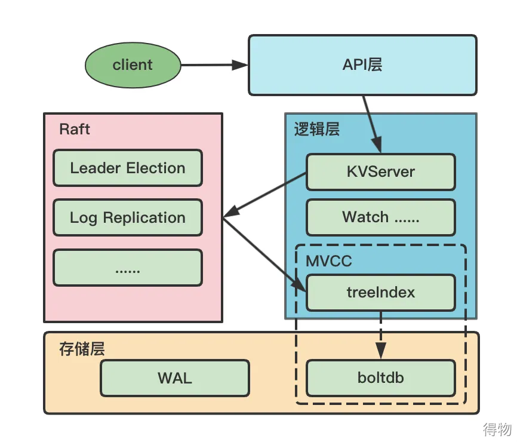

# ETCD 一种强一致性的分布式键值存储的协调框架

etcd是一种强一致性的分布式键值存储，它提供了一种可靠的方式来存储需要由分布式系统或机器集群访问的数据。它优雅地处理网络分区期间的leader选举，并且可以容忍机器故障。

一个用户的请求发送过来，会经由 HTTP Server 转发给 逻辑层进行具体的事务处理，如果涉及到节点的修改，则交给 Raft 模块进行状态的变更、日志的记录，然后再同步给别的 etcd 节点以确认数据提交，最后进行数据的提交，再次同步。
场景：与zookeeper一样，有类似的应用场景，包括服务发现、配置管理、分布式协调、Master选举、分布式锁、负载均衡